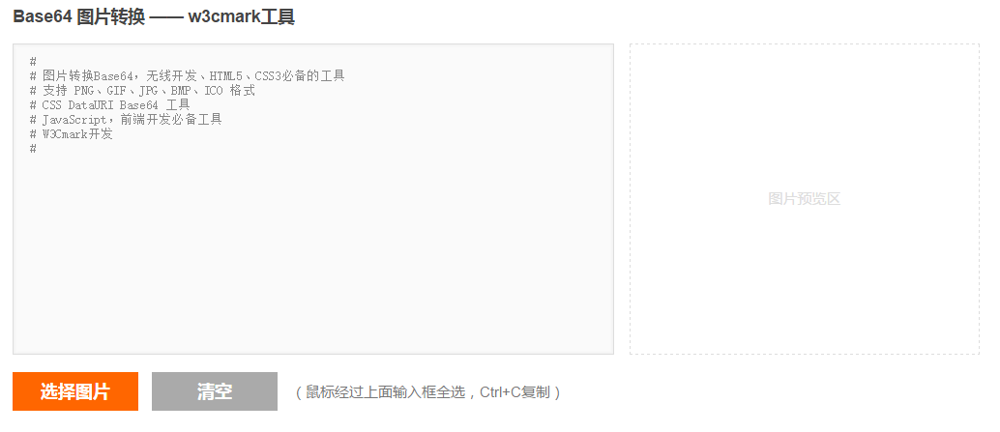

# 各种工具

>主要存放自己写的一些工具。

### Base64

+ 工具介绍

把图片转换成base64的编码，可以减少页面的http请求。

+ 工具截图

+ 工具地址

http://www.w3cmark.com/tools/base64.html

### 二维码在线生成

+ 工具介绍

把链接或文字转换成二维码，通过扫描二维码访问相应的内容。

+ 工具截图

+ 工具地址

http://www.w3cmark.com/tools/ewm.html

Powered by http://www.w3cmark.com

